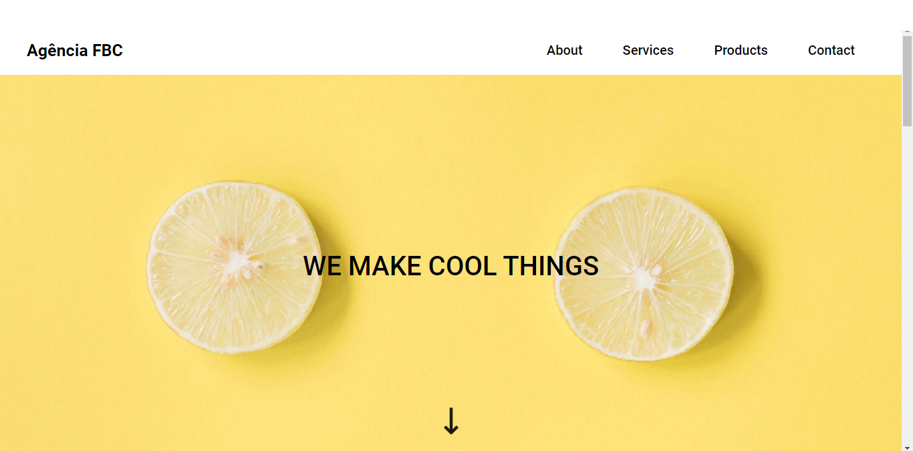
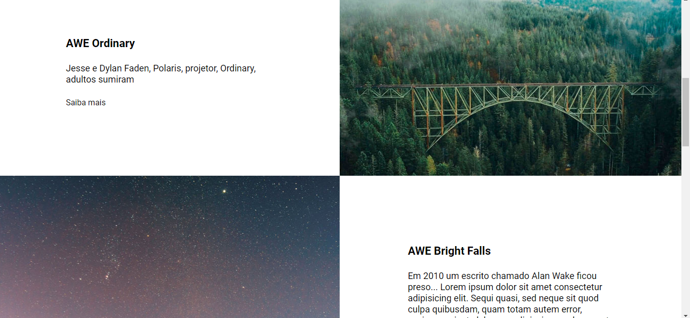
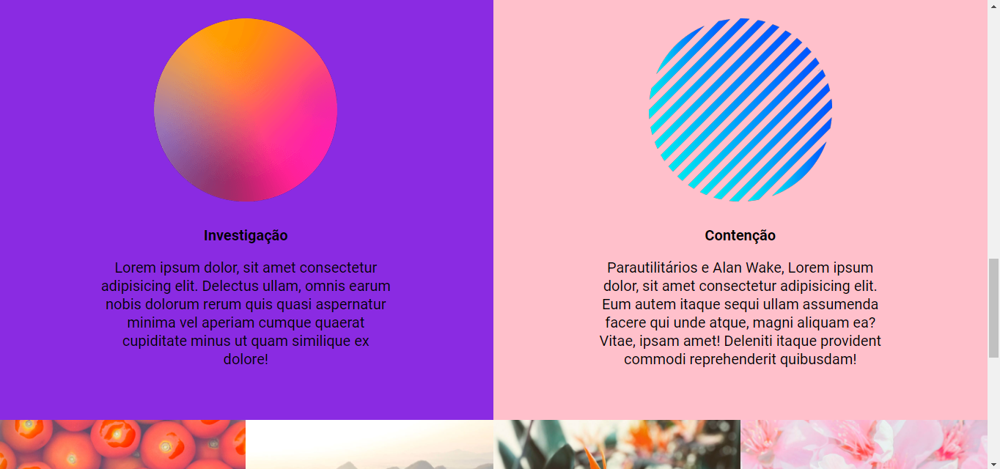
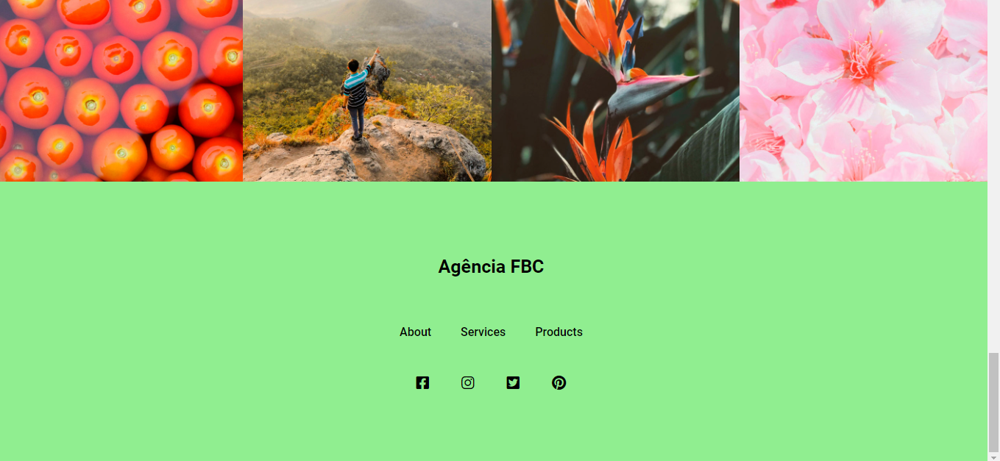

## Landing page básica, com elementos diversos, para uma agência fictícia nomeada de FBC
Esta landing page tem o objetivo de exercitar os meus conhecimentos em HTML e CSS, principalmente, nos conceitos de Flexbox e Grid. A agência é fictícia e os elementos de imagens são aleatórios para exercitar os conhecimentos. 

## Tecnologias utilizadas
- HTML;
- CSS.

## Como utilizar
1- Página inicial com menu e setinha que aponta para baixo e indica que a tela contém mais elementos. 

2- Página que mostra elementos sobre a empresa

3- Página dos serviços da empresa

4- Página que contém os principais produtos e as formas de contato, com os ícones das principais redes sociais da empresa. Todos os ícones redirecionam para a página de login das redes sociais, além do clique nos produtos redirecionar para uma busca sobre o tema no google. Os ícones das redes sociais foram importados do Font-awesome.

## Serviços Usados
- GitHub;
- VSCode;
- Font-Awesom;
- GitHub Pages.

## Funcionalidades
A principal funcionalidade é servir de modelo para estudos, exercitando o conhecimento nas tecnologias listadas acima. 

## Links
- GitPages: https://ricardovcastilho.github.io/landing-page-agencia-FBC/

- Repositório: https://github.com/RicardoVCastilho/landing-page-agencia-FBC

## Autor
- Ricardo Vitor Castilho.